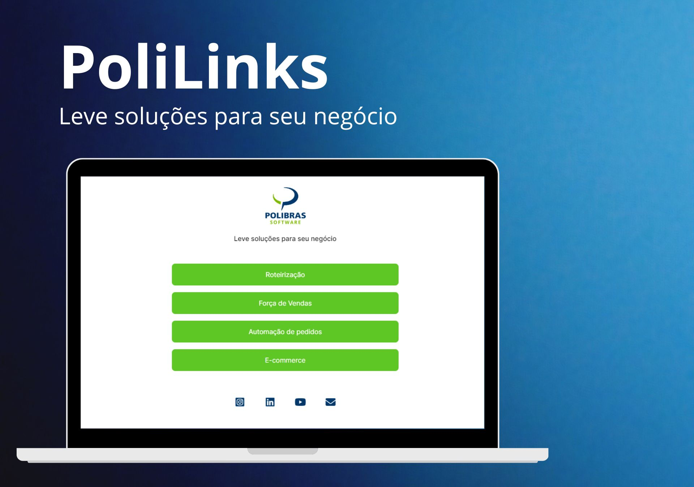

<h1 align="center"> PoliLinks </h1>

  

 

  

## 🚀 Tecnologias

Esse projeto foi desenvolvido com as seguintes tecnologias:

- HTML e CSS
- Git e Github
- Figma

## 💻 Projeto

O PoliLinks é um agregador de links para usar como cartão de visitas online.

- [Acesse o projeto finalizado, online](https://maykbrito.github.io/devlinks)

## 🔖 Layout

O Layout do projeto foi desenvolvido usando o editor gráfico Figma. É necessário ter conta no [Figma](https://figma.com) para usar essa ferramenta de design.

## Licença

Esse projeto está sob a licença MIT.

---

Desenvolvido por  [Matheus Lima 👨‍💻](https://www.linkedin.com/in/mattheuz-lima/)